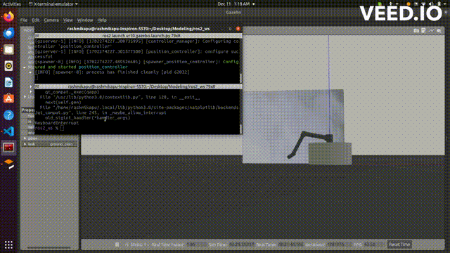
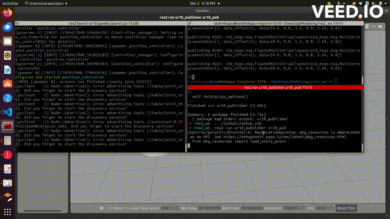

-------READ ME----------


Place all the packages under a ros2 (preferably galactic) workspace

--> Build the packages using :


```
colcon build

. ./install/setup.bash

```

--> Launch the gazebo package : 

```
ros2 launch ur10 gazebo.launch.py

```

--> Launch the gazebo and RViz together : 

```
ros2 launch ur10 debug.launch.py

```

In other terminal :

Launch the publisher script to make the robot draw a circle :

source your workspace 

```
ros2 run ur10_publisher kinematics
```


For the urdfs : 

ur10/urdf


# RESULTS :


